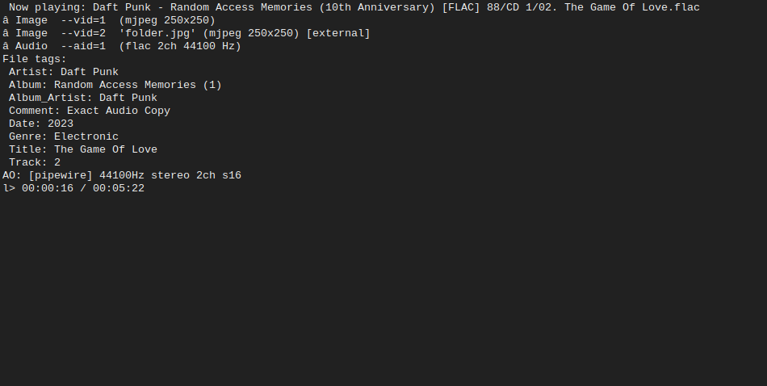

<div align="center">



A lightweight terminal-based music player built with mpv.
Search, queue, loop, and play — from YouTube or FLAC collections.
</div>

---

#### Features
 
 - save your song names under each other in playlist.txt
 - play your playlist: `./simple-music-player playlist.txt`, or `./simple-flac-player playlist.txt`
 - add songs to play and make playlist inside music players.
 - Loop current song with Shift+l
 - skip current song with q
 - use arrows to skip seconds in current song
 - download the flac songs with wget url.

   #### Required packages

`wget jq ffmpeg mpv yt-dlp espeak`

#### Run the Music Player
```
curl -LO https://raw.githubusercontent.com/Sushkyn/simple-music-player/main/simple-music-player && chmod +x simple-music-player && ./simple-music-player
```
#### Run the Flac Player (use flac player if you desire higher quality music)
```
curl -LO https://raw.githubusercontent.com/Sushkyn/simple-music-player/main/simple-flac-player && chmod +x simple-flac-player && ./simple-flac-player
```
#### optional: Get termux notification (add --input-ipc-server=mpvsocket on mpv)
```
curl -LO https://raw.githubusercontent.com/Sushkyn/simple-music-player/main/mpv-termux-notify.sh && chmod +x mpv-termux-notify.sh && ./mpv-termux-notify.sh
